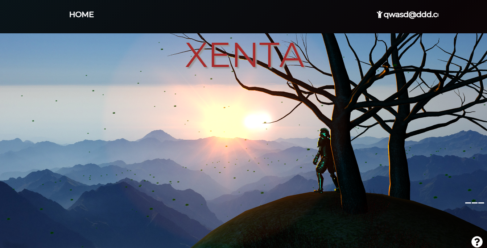

<h1 style="text-decoration: underline;">Frontend for Xenta's game website <h1>

<a href="https://xenta.netlify.app/" rel="noopener noreferrer" target="_blank"
style="justify-content= center; align-content: center; cursor: pointer;">
    Website
</a>
 
 
<a href="https://github.com/Rogerpeke97/APISpring" rel="noopener noreferrer" target="_blank"
style="justify-content= center; align-content: center; cursor: pointer;">
    Backend
</a>

### `Technologies used`:

        <h4 style="flex: 0.25; cursor: default">React.js:</h4>
        

 

        <h4 style="flex: 0.25; cursor: default">Three.js:</h4>
        <a href="https://threejs.org/" rel="noopener noreferrer" target="_blank"
        height= "50px" width= "50px" cursor= "pointer"">
            </img>
        </a>

 

### `Run the website`
After cloning the repository type `npm i` in the console to install the dependencies, after that use `npm run start` to run the website in your localhost.

### `Game screenshots`

 

 

